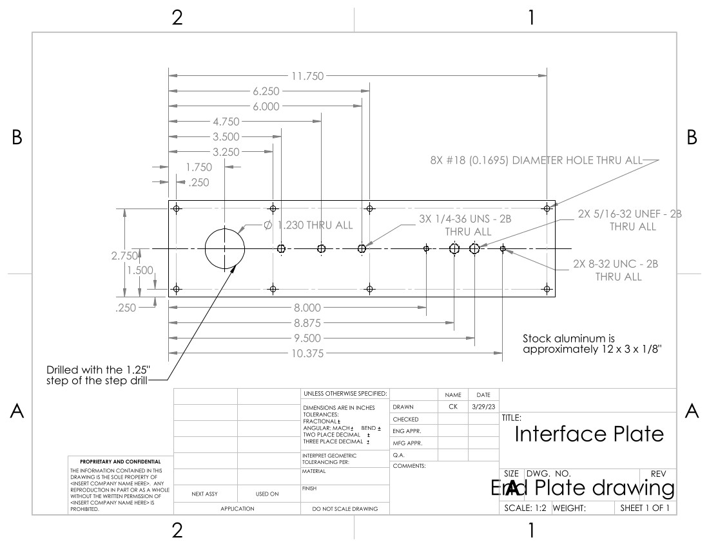
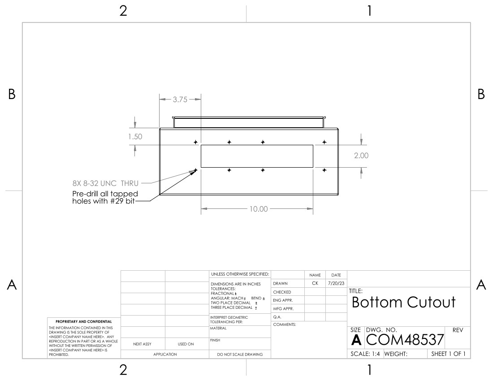
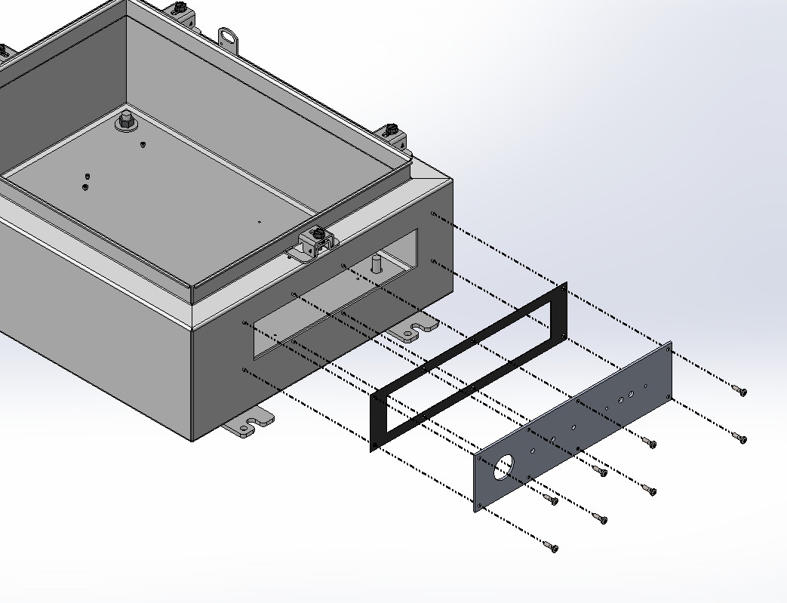

# The Box

Here one can find documentation re: the GReX box, including cables, 
routing, etc.

## Interface Plate

The custom interface plate is machined from stock aluminum
measuring approximately 12x3x1/8 inches. The drilled holes are
measured such that the stock size does not need to be precise.
The drilled hole specifications are shown in the drawing below:

|       Interface Plate Drawing        |
|:------------------------------------:|
|  |

Note that the eight tapped holes around the perimeter of the 
piece should first be drilled with a #29 bit. After aligning
the plate and marking the bottom of the box, the holes are re-drilled
using the specified #18 bit.

To adhere the interface plate to the main box, first the
cutout must be made with a hand saw. Refer to the drawing below
for placement. Note that the "bottom" of the box is defined when 
the lid is facing upwards and the hinge is on the left side. 
Double check that the internal ground pin is not removed or damaged with the cutout.

|        Box Cutout Drawing        |
|:--------------------------------:|
 |  |

After the cutout is finished, use the interface plate to mark
the location of the eight screw holes. When determining the position
of the interface plate, ensure that there is sufficient clearance space
for the locking washer on the nipple pipe.

Affix the interface plate and conductive rubber gasket to the box with pan head cross
screws, #8-32 5/16".

|       Interface Plate Assembly        |
|:-------------------------------------:|
|  |

Grind down the back cover of the weatherproof box so that it lays
flat against the interface plate. Drill the center hole with the 
step drill and the clearance holes for the 8-32 screws. Alignment is 
not critical, as long as the center feedthrough connectors are within the center hole,
and the distance between the outer tapped holes matches with their distance
on the interface plate. 

|   Weatherbox Modifications     |
|:------------------------------:|
|  |

Note the location of the green ground pin when the
weather box is affixed to the interface plate. Use the provided plugs
to close both side holes. 

Punch out the center hole and corresponding screw holes from the provided
 foam weatherbox gasket. Be sure to thread the extension cord wire through the
 lid and gasket prior to soldering the wires to the feedthroughs. Close both
 weatherbox lid side holes with the provided plugs. 

|           Weatherbox Assembly           |
|:---------------------------------------:|
|  |

The 1in diameter pipe is secured on both sides by a locking washer (not pictured).
The three SMAs are secured with one nut outside, one locking washer and two nuts
inside. 

Trim the foam gasket flush to the weatherbox, and the conductive gasket 
flush to the interface plate. Using RTV108 translucent adhesive, 
seal the following edges: between the weatherbox lid and body, around all plugs
in the weatherbox, around the outside of the interface plate, and around the outer
locking washer of the 1in nipple pipe.

## Enclosure Plate

The steel plate that comes provided with the enclosure box is discarded and
replaced instead with an aluminum plate. Use a step drill for the four corner
post holes. Drill the chassis holes on the bottom layer of the FEM assembly
so that they fit 4-40 hardware. For the SNAP and GPS boards which are attached 
with standoffs, the screw length to affix the board to the standoff is 3/16"
and to affix the standoffs to the plate the length is 1/4".

|           Enclosure Plate Drawing            |
|:--------------------------------------------:|
|   |

After affixing the FEM, screw the MiniCircuits amplifiers to the SMA connectors 
to determine how high they sit off the plate. Fill the gap with 2-56 size
washers (should be around 3). Drill the 2-56 clearance holes for the amplifiers
with them in place. Choose appropriate screw length, will vary if many more or less 
than 3 washers used.

If the SNAP is being inserted 'upside-down' in order to incorporate a heat sink
between the SNAP FPGA and aluminum plate, the following drawing should be used
instead:

|           Plate with Heat Sink           |
|:----------------------------------------:|
|  |

Info on the heatsink will go here...

Info on thermally coupling the plate to the box will go here: 0.9 in 
separation, possibly aluminum channel sandwiched with thermal squishies.

## Enclosure Lid

The lid is best drilled in the open position from the inside, so that more
precise measurements can be made from the inner wall of the lid edge.

|      Enclosure Lid Drawing      |
|:-------------------------------:|
|  |

For the RPi and PSU, the standoffs are 4-40x1/2" hex. Screws through the boards 
are 3/16" and screws through the lid are 1/4". The switch is secured by
3/16" screws and is backed with a split ring washer and nut. The LRS-50 uses
metric hardware 3mm in length.

## Fan

The fan is attached to the lid with 1/4" L brackets and 4-40 hardware. 5/16" screws 
from the fan into the threaded side of the L bracket. 3/4" hardware with locking
washer + nut combo from L bracket through the lid.

## Wiring

TODO: a schematic would be nice

* Valon
  * Red/black braided wire from +6Vdc to 'Valon' terminal of PSU
  * 086-3SMR+ cable from Source 1 SMA to top middle FEM
  * 086-8SMR+ cable from Ext Ref SMA to top left GPS
  * 086-12SMRSM+ cable from Source 2 SMA to 4th from right SNAP
* FEM
  * 086-24SMRSM+ cable from top left to POL A on interface
  * 086-24SMRSM+ cable from top right to POL B on interface
  * 4 port terminal (splice to red/white braided wire) to FEM terminal of PSU
  * 4 port terminal (splice to blue/green wire) to TXD, RXD terminal of RPi
  * 086-4 or 086-3SM+ cable from bottom left amp to 6th from left SNAP
  * Red/white braided wire from bottom left amp to RPi terminal PSU
  * 086-4 or 086-3SM+ cable from bottom right amp to 9th from left SNAP
  * Red/white braided wire from bottom right amp to RPi terminal PSU
* GPS
  * 086-15SMRSM+ cable from top right to 5th from right SNAP
  * 086-24 cable from bottom SMA to GPS on interface
  * Power plug to Fan terminal of PSU
* SNAP
  * 6 pin power plug to SNAP terminal of PSU
* Switch
  * Power plug to Switch terminal of PSU
  * Insert SFP+ 1 and 2
  * Ethernet cable from PoE In to bottom left ethernet plug of RPi
* LRS-50
  * Black, red wire from V-, V+ to GND, 12V terminal of PSU
  * Black, white wire from L, N to H, N feedthroughs on interface
  * Green cable from GND to bottom ground pin
  * Green cable from lid ground pin to bottom ground pin
* RPi
  * Red/white braided wire from 5V, GND terminal to RPi terminal of PSU
  * Red/white braided wire from 1020, GND terminal to 

## Mounting Brackets

Cut the square tube to 15" plus four 1" spacers. Drill out the 10th hole
from the uncut end. Drill a hole between the 6th and 7th holes (from the 
uncut end). Insert the v-bolt and saddle lock into the drilled holes, fix 
with washer and nut.

## Final Steps

Apply lock-tite to all hardware except those with nylocks.
