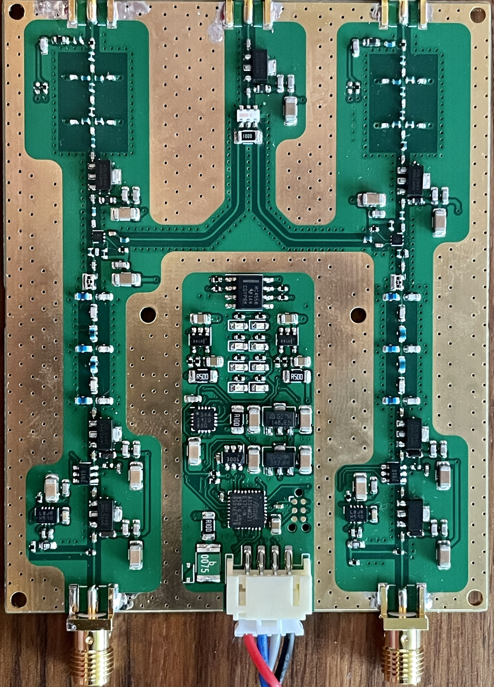
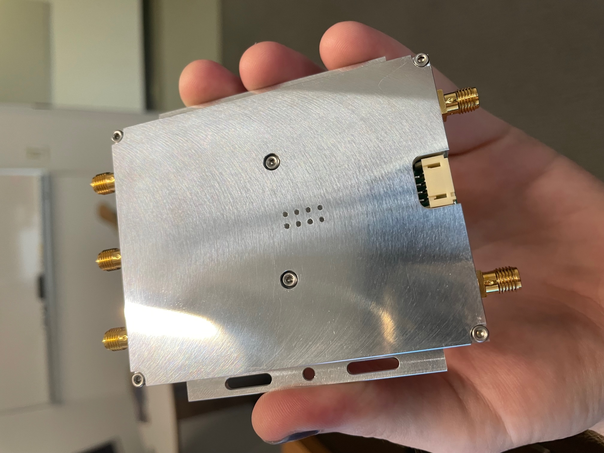
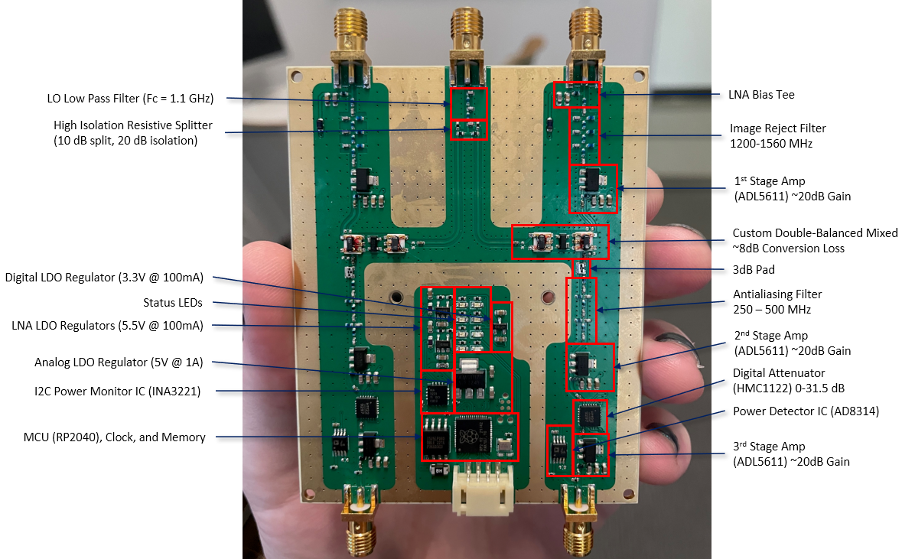

# Frontend Module

The frontend module (FEM) is a device that performs the analog signal processing
after the LNAs. This includes filtering, downconversion, and amplification.
Additionally, this module provides rudimentary monitor and control support.

|          Bare PCB          |    Completed Module    |
| :------------------------: | :--------------------: |
|  |  |

## Hardware Design

The hardware design itself is implemented in the free [KiCAD](https://www.kicad.org/)
program and is available [here](https://github.com/GReX-Telescope/FrontendModule).
The current hardware uses ENIG to help reflow of the fine-pitch components.
Additionally, it utilizes the low-loss RO4003C substrate in a custom 4-layer stackup.

- Schematics
- BOM
- Case

Here is an annotated view of the PCB with major system components labeled:



## Software Design

The RF hardware mostly operates without the intervention of any software. The
only step required to use the RF hardware is to set the valid attenuation level,
which defaults to 0 dB. As such, the primary goal of the digital section of the
FEM is to perform Monitor and Control (MnC). MnC is achieved via an 115200 baud
3.3V UART interface on the main connector. The firmware design is carried out
in the Rust programming language, and whose source can be found
[here](https://github.com/GReX-Telescope/FEM_Firmware). In that repository, one
can also find the control software, which is used to perform the monitoring and
controlling.

With this software, there is control for enabling/disabling the LNA bias and
setting the interstage IF attenuator. For the digital attenuator,
we can set attenuation (and therefore change the total gain) from 0 dB to 31.5 dB.
This attenuator is used to maximize the dynamic range of the ADC and can be set
for environmental RFI levels.

### CLI

To use the CLI program, connect the FEM to a serial port either with a USB to serial
adapter or directly to a hardware UART port (like on the Raspberry Pi). If the pi doesn't
have the cli program already copied over, it can be found [here](../assets/cli).

```sh
Usage: cli <PORT> <COMMAND>

Commands:
  mon    Gets monitor data from the FEM
  lna    Controls the power of the LNA
  if     Sets the IF "power good" threshold
  atten  Sets the attenuation level in dB (0 to 31.5)
  help   Print this message or the help of the given subcommand(s)

Arguments:
  <PORT>  Serial port for the FEM

Options:
  -h, --help     Print help
  -V, --version  Print version
```

To set the power state of the LNAs, use:

```sh
./cli <serial-port> lna ch<1|2> <enabled|disabled>
```

To set the attenuation:

```sh
./cli atten <0-31.5>
```

To grab the monitor data:

```sh
./cli mon
```

### Physical Interface

There are eight LEDs on the front panel. Four red LEDs to indicate power
statess, two blue LEDs for serial activity, and two green LEDs for system
status. The green LEDs will be enabled when the IF power is at a nominal
level.
