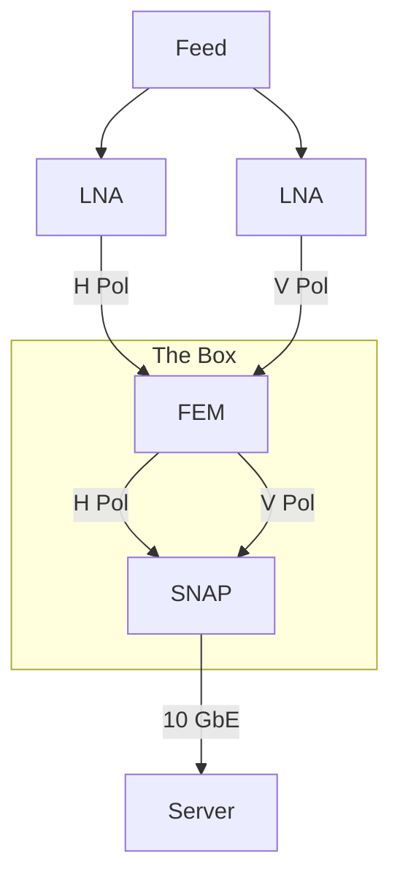
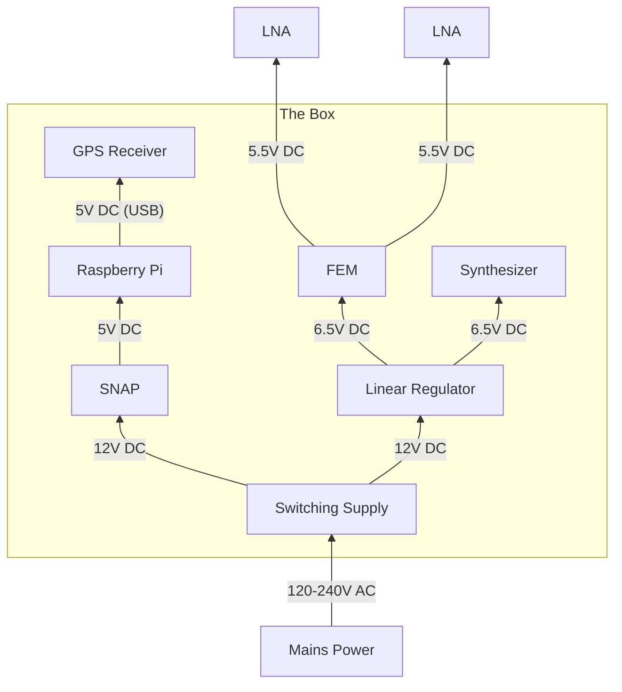
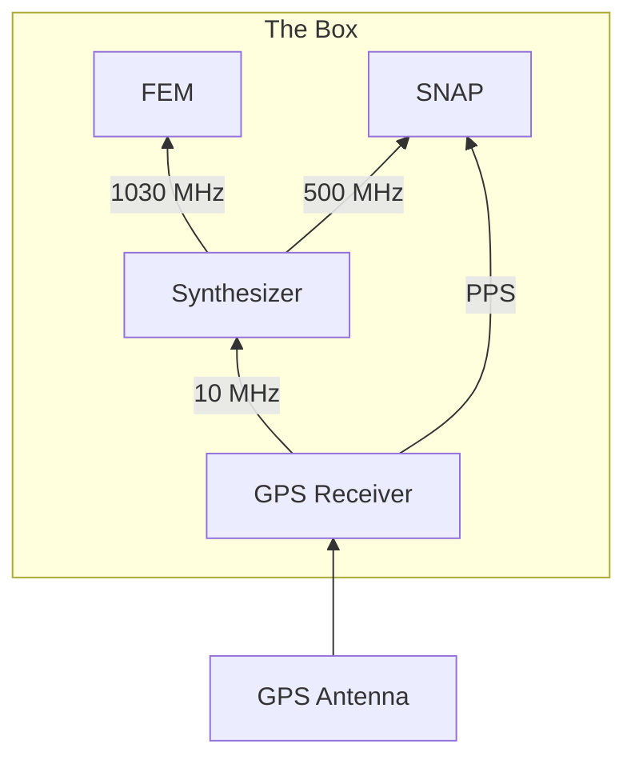
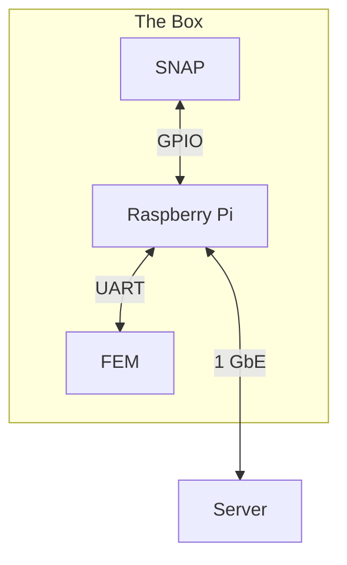

# Hardware Overview

The GReX hardware system has several "top level" components, which constitute
the entire system. These include the [feed antenna](feed.md) and low noise
amplifiers (LNA), the [frontend module](fem.md), the [digital backend](fpga.md),
and of course the server. The following diagrams lay out general overview of the
interconnections. Showing them all at once would be a bit much, so they're
broken down here into discrete kinds of signals.

## RF Signal Path

## Power Distribution

## Clocks, References and Timing

## Monitor and Control

