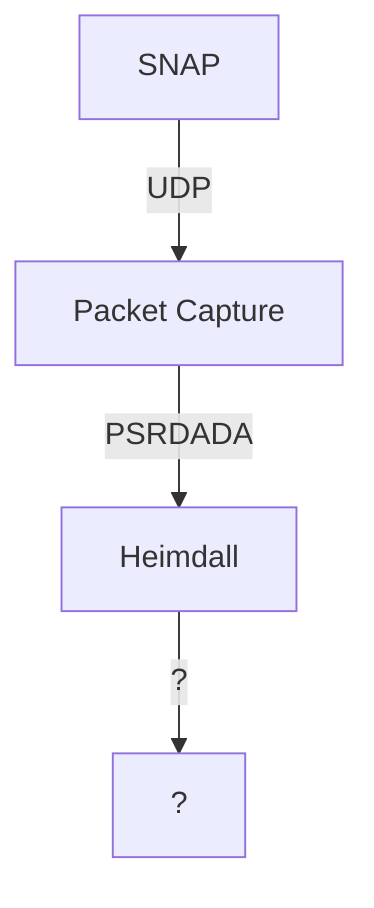

# Software Overview

!!! note

    I don't really understand this yet

There are two primary components to the software stack in GReX. First, the SNAP
board must be configured and setup to send voltage data to the server. After
that, the pipeline software _should_ take care of the rest. This pipeline will
exist as a composition of [Guix](https://guix.gnu.org/) packages and potentially
as a [Guix
System](https://guix.gnu.org/manual/en/html_node/Invoking-guix-system.html)
definition for the entire system. This is to ensure determinisim in builds and
to reduce the potential of mis-configuration.

## Pipeline Overview

