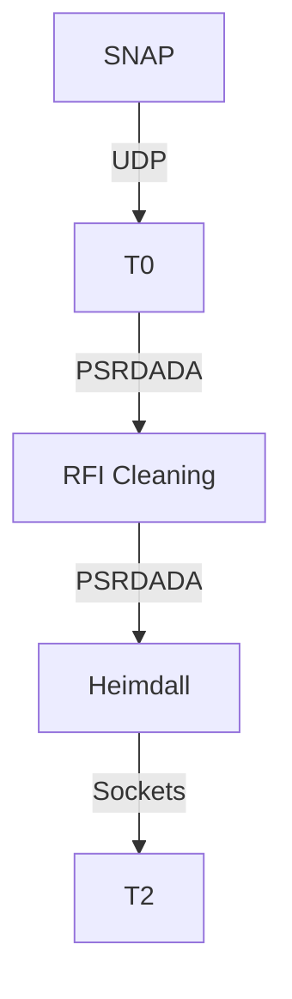

# Software Overview

There are two primary components to the software stack in GReX. First, the SNAP
board must be configured and setup to send voltage data to the server. After
that, the pipeline software _should_ take care of the rest.

## Pipeline Overview

## Software Manifesto

To limit downtime and maximize reproducability, we will try to adopt a consistent software development strategy. Primarily:

- Builds will be deterministic and reproducible
- Code will be version controlled, organized, and public

### Language Specific

#### Rust

- No clippy warnings
- Avoid unsafe
- Document everything
- Formatted with rustfmt

#### C++

- Code will be formatted with clang-format's LLVM style
- Try to minimize (solve) all errors from -Wall

#### Python

- Code will be formatted with Black
- Docstrings will follow the [numpy format](https://numpydoc.readthedocs.io/en/latest/format.html)
- Gradual typing will be used (PEP 438) and checked with mypy or equivalent
- Environments will have pinned dependencies (reproducible)

Most of this can be accomplised by using [Poetry](https://python-poetry.org/).