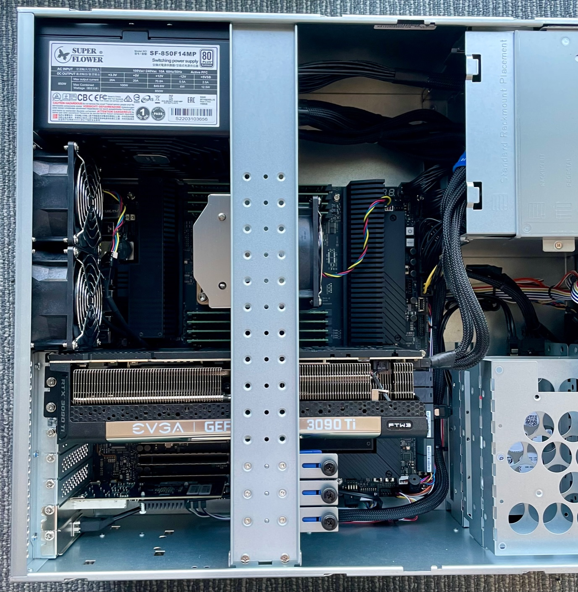

# Server Setup

Once you get your server (either from Puget systems or otherwise), we need to setup additional hardware, adjust some system settings, setup networking, and install the pipeline software.

## Hardware Setup

The server straight from Puget does not have the GPU or 10 GbE network card installed, we will do this first.

1. Open the case and remove the GPU retention bracket
2. Remove the test GPU (T1000), keep this for later in case we need an aditional video output
3. Install the 3090 Ti in the first GPU slot, this will take up three slots of space
4. Install the network card in the bottom slot
5. Wire the 3090 Ti power cable to the harness provided by Puget (they knew this was the GPU we were going to install)
6. Remove the GPU retention clips from the retention bracket that would interfere with the card. It's too tall for it anyway.
7. Replace the retention bracket and close the case.



Finally, we need to hook up a monitor to the 3090 Ti so we can setup the software

## Initial OS Setup

On boot, you will be presented with the Ubuntu graphical interface. If a password is requested, the deafult is provided in the information booklet that came with the hardware.

First, we will change the system password. Set this to something memorable.

```sh
passwd $(whoami)
```

Now, we will update the system. There shouldn't be many updates if this is a new machine.

```sh
sudo apt-get update
sudo apt-get upgrade -y
```

We will be editing a bunch of files, if you are comfy in the command line, you probably want to install some editors. Otherwise the graphical `gedit` tool will be fine.

```sh
sudo apt-get install emacs vim -y
```

Finally, we will set the hostname. We'll be using the `grex-<affiliation>-<location>` paradigm (just for clarity, no real reason not to).
As in, the first server that is managed by Caltech at OVRO will be `grex-caltech-ovro`.

```sh
sudo hostnamectl set-hostname <your-hostname>
```

Some updates may require a reboot. If it asks, do that now.

## Networking

Now, we need to setup the networking for the GReX system. We will operate under the assumption that the internet-facing connection will get an IP address from a DHCP server. If that is not the case, consult whoever runs your network on the appropriate setup. Regardless of the WAN connection, the 10 GbE fiber connection to the GReX terminal will be configured the same.

### Overview

The 10 GbE fiber port serves a few purposes. It is the main data transfer link between the FPGA in the field and the server, but it also carries the monitor and control for the box. This monitor and control connection includes the SNAP control connection and the Raspberry Pi. The SNAP requires an external DHCP server, which we have to provide on this port. Additionally, the 10 GbE switch in the box has its own default subnet for configuration (`192.168.88.X`). To make everything talk to each other, we need to add two IPs on this port: one in the subnet of the switch's config interface, and the other for DHCP of the various devices.

### Netplan

In `/etc/netplan` remove any files that are currently there.

Check whether you are using NetworkManager or networkd:
```
systemctl status NetworkManager
systemctl status systemd-networkd
```

If NetworkManager is running and networkd is not, disable NetworkManager and enable networkd. (Otherwise, skip this step.)
```
sudo systemctl stop NetworkManager
sudo systemctl disable NetworkManager
sudo systemctl enable systemd-networkd
```

Then, create a new file called `config.yaml` with the following contents

```yaml
network:
    version: 2
    renderer: networkd
    ethernets:
        # Two WAN interfaces. Configure this according to your network setup
        enp36s0f0:
            dhcp4: true
        enp36s0f1:
            dhcp4: true
        # 10 GbE connection over fiber to the box
        enp1s0f0:
            mtu: 9000
            addresses:
                - 192.168.0.1/24
                - 192.168.88.2/24
```

Then apply with

```sh
sudo netplan apply
```

### DHCP Server

Now, we need to setup the DHCP server on the 10 GbE port. First, we install the DHCP server software:

```sh
sudo apt-get install dnsmasq
```

Create the configuration file in `/etc/dnsmasq.conf`

```ini
# Only bind to the 10 GbE interface
interface=enp1s0f0
# Disable DNS
port=0
# DHCP Options
dhcp-range=192.168.0.0,static
dhcp-option=option:router,192.168.0.1
dhcp-option=option:netmask,255.255.255.0
dhcp-host=00:40:BF:06:13:02,192.168.0.3,snap
log-async
log-queries
log-dhcp
```

This sets up a very simple DHCP server that just gives the IP address `192.168.0.3` to the SNAP, which has a hard-coded MAC address.

Finally enable the DHCP server service

```sh
sudo systemctl enable dnsmasq --now
```

And check the status to make sure everything came up ok

```sh
sudo systemctl status dnsmasq
```

Finally,

```sh
sudo reboot
```

After reboot, assuming your fiber line is plugged into the box and the SNAP is turned on, you can check the lease by looking at

```sh
cat /var/lib/misc/dnsmasq.leases
```

### Advanced 10 GbE Settings

Unfortunatley, the OS's default configuration for the 10 GbE network card is not optimized for our use-case of streaming time domain science data. As such, we need to adjust a few things.

Add the following to `/etc/sysctl.conf`

```conf
kernel.shmmax = 68719476736
kernel.shmall = 4294967296
net.core.rmem_max = 536870912
net.core.wmem_max = 536870912
net.core.optmem_max = 16777216
vm.swappiness=1
```

Then apply these changes with 

```sh
sudo sysctl --system
```

Now, we need a program called `ethtool` to apply some more settings

```sh
sudo apt-get install ethtool -y
```

Now we will create a file to run on boot to apply a sequence of ethtool settings.

Create the file `/etc/rc.local` with the following contents:

```sh
#!/bin/env bash
ethtool -G enp1s0f0 rx 4096 tx 4096
ethtool -A enp1s0f0 rx on
ethtool -A enp1s0f0 tx on
```

Make this file executable with

```sh
sudo chmod +x /etc/rc.local
```

Then enable the `rc-local` service

```sh
sudo systemctl enable rc-local
```

Now create the file `/etc/systemd/system/rc-local.service` with the following contents:

```ini
[Unit]
 Description=/etc/rc.local Compatibility
 ConditionPathExists=/etc/rc.local

[Service]
 Type=forking
 ExecStart=/etc/rc.local start
 TimeoutSec=0
 StandardOutput=tty
 RemainAfterExit=yes
 SysVStartPriority=99

[Install]
 WantedBy=multi-user.target
```

Finally, reboot

## Guix

We use the deterministic pacakge manager Guix to deal with the more tricky to install things, so we never have to worry about stuff not building.

You can install this with the Ubuntu package manager

```sh
sudo apt-get install guix
```

Then, we will add the repository of our pacakges by creating the following file `~/.config/guix/channels.scm`

```lisp
(cons (channel
        (name 'guix-grex)
        (url "https://github.com/GReX-Telescope/guix-grex.git")
        (branch "main"))
      %default-channels)
```

And then have it self-update with

```sh
guix pull
```

This step may take a while.

Create (or add to) `~/.bash_profile` 

```sh
GUIX_PROFILE="$HOME/.guix-profile"
. "$GUIX_PROFILE/etc/profile"
if [ -f ~/.bashrc ]; then
    source ~/.bashrc
fi
```

In here, we're also souring `~/.bashrc` so we get it over ssh.

Finally, install the pipeline dependencies with:

```sh
guix install psrdada snap_bringup heimdall-astro
```

## Rust

Many parts of the pipeline software are written in the Rust programming language.
We will build be building this software from scratch, so we need to install the rust compiler and it's tooling.
This is easy enough with [rustup](https://rustup.rs/)

We need curl for the rustup installer, so

```sh
sudo apt-get install curl -y
```

Then run the installer, using all the default settings

```sh
curl --proto '=https' --tlsv1.2 -sSf https://sh.rustup.rs | sh
```

## Python

To get out of version hell for python stuff *not* packaged with guix, we're using [Poetry](https://python-poetry.org/). To install it, we will:

```sh
curl -sSL https://install.python-poetry.org | python3 -
```

We need to make a few adjustments to `~/.bashrc` to correct the paths and fix a bug. Append the following to the end.

```sh
export PATH="/home/user/.local/bin:$PATH"
# Fix the "Poetry: Failed to unlock the collection" issue
export PYTHON_KEYRING_BACKEND=keyring.backends.null.Keyring
```

Go ahead and `source ~/.bashrc` now to get these changes in your shell.

## Pipeline Software

To organize all the software needed for running the whole pipeline, we will grab the metapackage from github and clone somewhere (like the home directory):

```sh
cd
git clone --recurse-submodules https://github.com/GReX-Telescope/grex
```

Then, assuming you followed all the previous steps, build the pipeline software with

```sh
./grex/build.sh
```

## Prometheus

To save data about the server (CPU usage, RAM usage, etc) and to collect monitoring metrics from various pieces of pipeline software, we use the [prometheus](https://prometheus.io/) time series database. Each server will host its own database and *push* updates to the monitoring frontend Grafana.

First, create a new group and user

```sh
sudo groupadd --system prometheus
sudo useradd -s /sbin/nologin --system -g prometheus prometheus
```

Next, we create the path for the database. Puget setup the system so the large storage drive is mounted at `/hdd`. We will keep the database there.

```sh
sudo mkdir /hdd/prometheus
```

Prometheus primary configuration files directory is /etc/prometheus/. It will have some sub-directories:

```sh
for i in rules rules.d files_sd; do sudo mkdir -p /etc/prometheus/${i}; done
```

Next, get a copy of the prometheus binaries, extract, and move into that dir

```sh
mkdir -p /tmp/prometheus && cd /tmp/prometheus
curl -s https://api.github.com/repos/prometheus/prometheus/releases/latest | grep browser_download_url | grep linux-amd64 | cut -d '"' -f 4 | wget -qi -
tar xvf prometheus*.tar.gz
cd prometheus*/
```

Install the files by moving to `/usr/local/bin`

```sh
sudo mv prometheus promtool /usr/local/bin/
```

Move Prometheus configuration files to `etc`

```sh
sudo mv prometheus.yml /etc/prometheus/prometheus.yml
sudo mv consoles/ console_libraries/ /etc/prometheus/
```

Now, we configure. Open up `/etc/prometheus/prometheus.yml` and edit to contain:

```yml
global:
    scrape_interval: 10s
    evaluation_interval: 10s
scrape_configs:
    - job_name: "prometheus"
      static_configs:
      - targets: ["localhost:9090", "localhost:9100", "localhost:8083"]
remote_write:
    - url: <grafana-url>
      basic_auth: 
        username: <grafana username>
        password: <grafana api key>
```

If you are hooking up to our grafana instance, you will get an API key from the project, otherwise you'd create a `remote_write` section that reflects your monitoring stack.

Now, create a systemd unit to run the database in the file `/etc/systemd/system/prometheus.service`

```ini
[Unit]
Description=Prometheus
Documentation=https://prometheus.io/docs/introduction/overview/
Wants=network-online.target
After=network-online.target

[Service]
Type=simple
User=prometheus
Group=prometheus
ExecReload=/bin/kill -HUP \$MAINPID
ExecStart=/usr/local/bin/prometheus \
  --config.file=/etc/prometheus/prometheus.yml \
  --storage.tsdb.path=/hdd/prometheus \
  --web.console.templates=/etc/prometheus/consoles \
  --web.console.libraries=/etc/prometheus/console_libraries \
  --web.listen-address=0.0.0.0:9090 \
  --web.external-url=

SyslogIdentifier=prometheus
Restart=always

[Install]
WantedBy=multi-user.target
```

Now update all the permissions of the things we've mucked with to make sure prometheus can use them

```sh
for i in rules rules.d files_sd; do sudo chown -R prometheus:prometheus /etc/prometheus/${i}; done
for i in rules rules.d files_sd; do sudo chmod -R 775 /etc/prometheus/${i}; done
sudo chown -R prometheus:prometheus /hdd/prometheus/
```

Finally, reload systemd and start the service

```sh
sudo systemctl daemon-reload
sudo systemctl start prometheus
sudo systemctl enable prometheus
```

Now we will install the node-exporter, which gives us metrics of the computer itself.

```sh
sudo apt-get install prometheus-node-exporter
```

# Turning on the SNAP

To turn on the SNAP, SSH into the Pi (password is the same as the host machine) via

```sh
ssh pi@192.168.0.2
```

Then on the pi, run

```sh
python3 pwup_snap.py
```

There also exists `pwdn_snap.py`, with an obvious purpose.

# Preconfigured

These steps should already be performed before we ship a box, but for completeness, here are the steps that we performed.

## Valon

We need to configure the valon synthesizer to act as the LO for the downconverter and the reference clock for the SNAP ADC.

Use the GUI tool [here](https://valontechnology.com/5009users/5009.htm) to load [this](../assets/grex_valon.VR0) configuration file.
Next, go to synthesizer -> write registers.
Then, save the configuration to flash to preserve this configuration across reboots.

## Switch

With the box connected and powered on, create an SSH relay to the switch's configuration interface with

```sh
ssh -L 8291:192.168.88.1:8291 user@<the ip address of the server>
```

Then, using [winbox](www.mikrotik.com/download/winbox.exe) connect to localhost, 
select `files` on the left, and upload [this config file](../assets/GReX_Switch.backup). This should trigger a reboot.

## Raspberry Pi

We prepared the RPi image using the standard [raspbain lite OS](https://www.raspberrypi.com/software/operating-systems/).
As part of the initial image creation, we set the hostname to `grex-pi` and enabled password-based SSH.

Using `raspi-config`, we did the following:
- disabled the serial login shell
- enabled the hardware serial interface

Then, we disabled the hardware's radios by modifying the `config.txt` file [like so](https://raspberrytips.com/disable-wifi-raspberry-pi/).

Then, we configured the Pi to have the static IP address of `192.168.0.2` by following [this](https://www.makeuseof.com/raspberry-pi-set-static-ip/)

Then, we disabled HCI UART by running

```sh
sudo systemctl disable hciuart
```
